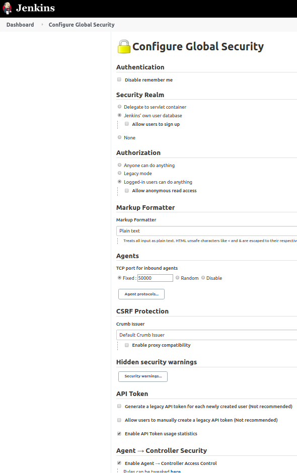
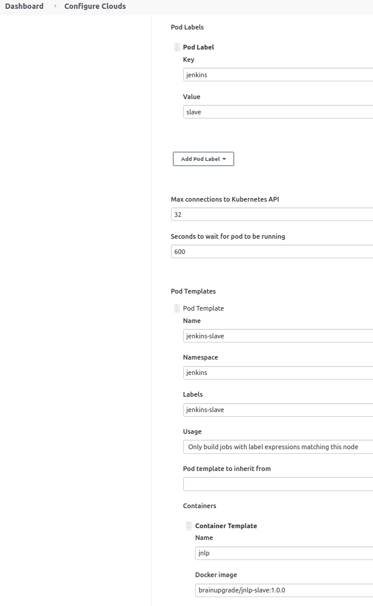
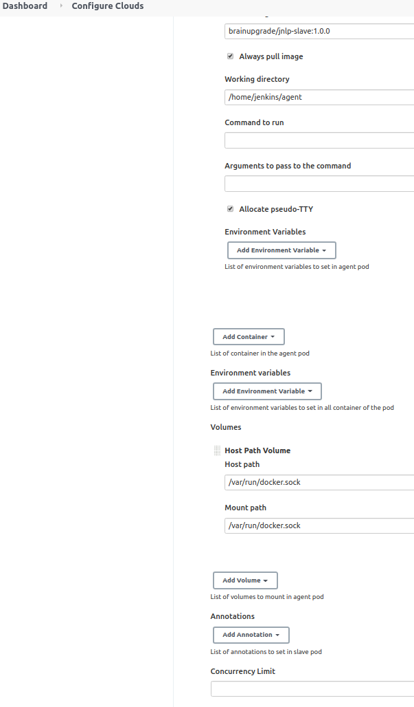
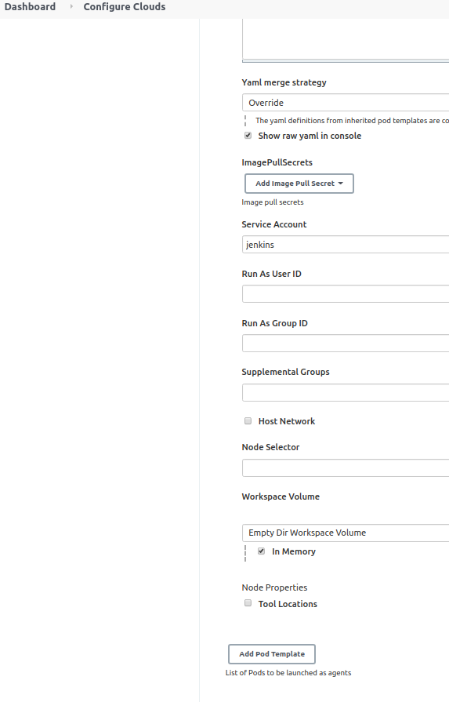

# Automated CI & CD - Scalable Jenkins on Kubernetes Cluster
Setting up scalable Jenkins on kubernetes can be a daunting dask.  Below is the step by step guide to make it happen.  

## Jenkins Master Node
Jenkins master uses the image ```sh brainupgrade/jenkins:2.274jdk11x ```

This image has many plugins required for smooth CD on kubernetes.  To know the image content, Dockerfile (./master/Dockerfile) is kept here

## Jenkins Slave Node

Jenkins slave uses the image ```sh  brainupgrade/jnlp-slave:1.0.0 ```

This image is based on openjdk11 containing maven, docker runtime so that spring boot 
project can be checked out, maven built including docker image building & deployment.

## Steps
### Launch Jenkins master
Run below kubernetes configurations
```sh
kubectl create ns jenkins
kubectl apply -f rbac.yaml
kubectl apply -f deploy.yaml
kubectl apply -f service.yaml
```

### Secure the master
Once Jenkins master server is deployed, it would take few minutes to get the UI up and running 
To access UI, run below
```sh
kubectl port-forward deploy/jenkins 8080:8080
```
and launch URL http://localhost:8080 on the browser

Go to http://localhost:8080/configureSecurity/ and secure the server by enabling security as shown in the below picture.

Once you save it, you will get an option to set username and password.



After login, come back to this URL again and select tick mark to Agent - Controller Security. This option gets visible after setting up username and password.

### Configure the Kubernetes plugin as shown in the snapshots below
Now go to the URL: http://localhost:8080/configureClouds and key in the configuration as shown in the below snapshots.






### Setup Global credentials
To test the docker commands especially login, first setup the global credentials as shown in below


### Create Build Job
Create docker-test job as Pipeline, click OK and insert below text in the pipeline block
```sh
pipeline {
    agent {
        kubernetes{
            label 'jenkins-slave'
        }
    }
    environment{
        DOCKER_USERNAME = 'brainupgrade'
        DOCKER_PASSWORD = credentials('docker-brainupgrade')
    }
    stages {
        stage('docker login') {
            steps{
                sh(script: """
                    docker login -u $DOCKER_USERNAME -p $DOCKER_PASSWORD
                """, returnStdout: true) 
            }
        }
    }
}
```

Click SAVE

### Test the pipeline
Run the docker-test job and you would see that a pod will be launched by Jenkins master to run the docker-test build job and the pod will be terminated immediately build completes.


Once build job completes, then build pod is terminated


## Kubernetes Cluster Info
- Kubernetes Server 1.19.7
- Cluster Management Tool - kops
- Cloud Provider AWS
